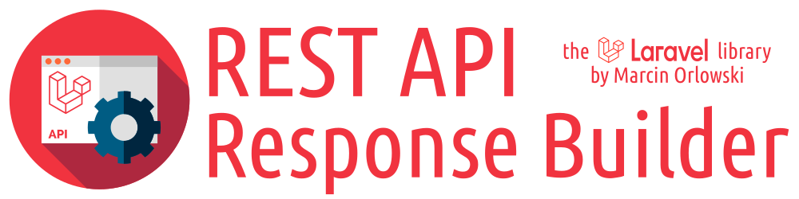

# REST API Response Builder for Laravel

## Table of contents

* [Introduction](#introduction)
* [Why should I use it?](#benefits)
* [Usage examples](docs/examples.md#usage-examples)
* [Features](#features)
* [Extensive documentation](docs/README.md)
* [License](#license)
* [Changelog](docs/CHANGES.md)

----

## Introduction

`ResponseBuilder` is a [Laravel](https://laravel.com/) package, designed to help you build nice,
normalized, and easy-to-consume REST API JSON responses.

## Benefits

`ResponseBuilder` is written for REST API developers by REST API developers, drawing from extensive
experience on both sides of API development. It's lightweight, has **no** dependencies, is
thoroughly tested, and is simple to use while remaining flexible and powerful. It offers support
for [on-the-fly data conversion](docs/conversion.md), [localization](docs/docs.md#messages-and-localization),
automatic message building, [chained APIs](docs/docs.md#code-ranges),
and [comprehensive documentation](docs/README.md).

Moreover, the JSON structure produced by `ResponseBuilder` is designed with **your API users** in
mind. Its [well-defined and predictable structure](docs/docs.md#response-structure) makes
interacting with your API using `ResponseBuilder` effortless. The simple, consistent JSON responses
are easy to consume. **Your** clients will appreciate it!

You're also covered in case of emergencies. The provided
[ExceptionHandlerHelper](docs/exceptions.md) ensures your API continues to communicate in
JSON (not HTML) with its clients, even in unexpected situations.

Additionally, it includes [testing traits](docs/testing.md) that help you add PHPUnit-based tests
for your `ResponseBuilder` integration with just a few lines of code.

## Features

* [Easy to use](docs/examples.md#usage-examples),
* [Stable and production ready](https://github.com/MarcinOrlowski/laravel-api-response-builder/releases)
* [On-the-fly data object conversion](docs/conversion.md),
* [API chaining support](docs/docs.md#code-ranges),
* [Localization support](docs/docs.md#messages-and-localization),
* Provides traits to help [unit test your API code](docs/testing.md),
* Comes with an [exception handler helper](docs/exceptions.md) to ensure your API remains consumable
  even in unexpected situations.
* [No additional dependencies](composer.json).

## License

* Written and copyrighted &copy;2016-2025 by Marcin Orlowski <mail (#) marcinorlowski (.) com>
* ResponseBuilder is open-source software licensed under
  the [MIT license](http://opensource.org/licenses/MIT)
