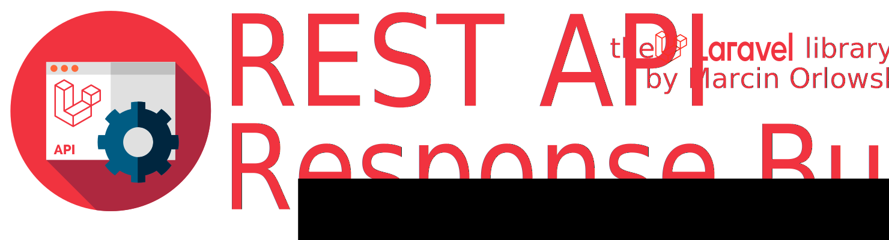

# Legacy support #

[« Documentation table of contents](README.md)

 * [Legacy support](legacy.md)
   * [Legacy versions](#legacy-versions)
   * [Developer's notes](#developers-notes)

 Legacy support should is most likely here and if anything is not working, fixing it is pretty trivial with use of recent
 code base, as long as your PHP is v7.2 or better.
 
---

## Legacy versions ##

 Starting from version 6.0, `ResponseBuilder` requires [Laravel](https://laravel.com/) v6 or newer which automatically means it
 also requires PHP 7.2+, same as Laravel.

 It however does not mean, recent `RespnseBuilder` will not work with older Laravel versions (and even lower PHP versions)
 but this is no longer officially supported. No unit tests run against anything older than Laravel 6.x and PHP 7.2,
 so if for any reasons you want to use new `ResponseBuilder` with legacy environment then you are on your own. At least ensure
 all unit tests pass.

 If you cannot upgrade for any reason, you can still use legacy `ResponseBuilder` v4, which supports Laravel 5.1+ and
 PHP 5.1 and up:

```bash
composer require marcin-orlowski/laravel-api-response-builder "^4.0" 
```

 Alternativel add dependency manually, by editing `composer.json` manually and add following line to `require` section:

```json
    "require": {
       "marcin-orlowski/laravel-api-response-builder": "^4.0",
      ...
    }
```

## Developer's notes ##

 `ResponseBuilder` does not really depend on Laravel features that much if ever. The only thing that matters is PHP version used
 because of PHP syntax `ResponseBuilder` code uses. So if you are using some old Larave setup but at the same time you use recent
 PHP version, you should be able to successfuly deploy a recent version of `ResponseBuilder` with all the features available.
 The only **possible** thing that may require additional investigation is the provided [Exception Handler helper](exceptions.md),
 however, current implementation relies on Exception Handler code from (IIRC) Laravel 5.5. So that shouldn't be a problem and is
 pretty easy to check. And if you are on even older Laravel, then backporting helpers' code should also be pretty easy. It's just
 no longer supported by me.

