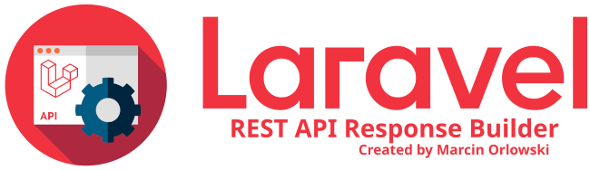

# Testing #

[« Documentation table of contents](README.md)

 * [Testing](testing.md)
   * [Unit testing your ApiCodes](#unit-testing-your-apicodes)
   * [Testing other code using ResponseBuilder](#testing-other-code-using-responsebuilder)
   
## Unit testing your ApiCodes ##

 `ResponseBuilder` ships with traits that you can use to ensure your ApiCodes class and its values
 as well as your app's `ResponseBuilder`'s config file is in good health. The testing trait
 tests will:

  * check if codes range is set correctly,
  * check if all codes defined in your `ApiCodes` class contain mapping entry in config,
  * check if all codes are in correct and allowed range,
  * check if all defined Api code constants' values are unique,
  * check if all codes are mapped to existing locale strings.

 Let's assume you got `ApiCodes` class that holds all your constants. Its file is `app/ApiCodes.php`
 and its namespace is `App`.

 To do our tests we first need to augment your `ApiCodes` with some code necessary for testing. This
 code comes as `ApiCodesHelpers` trait, but it is not needed for normal daily use, you should avoid
 adding it to the original `ApiCodes` class. Instead, we create new one that extends `ApiCodes` and
 uses said trait.

 Next, we need to create `PHPUnit` tests to validate `TestableApiCodes`, however you will not have
 to write any single tests yourself as there's another useful trait that will do the heavy lifting
 for you, and the only thing it needs for work is the name of codes class to be tested.

 Create `ApiCodesTest.php` file in `tests` folder with the following content:

```php
<?php

use MarcinOrlowski\ResponseBuilder\ApiCodesHelpers;
class TestableApiCodes extends \App\ApiCodes
{
    use ApiCodesHelpers;
}

use MarcinOrlowski\ResponseBuilder\Tests\Traits\ApiCodesTests;
class AppCodesTest extends TestCase
{
    use ApiCodesTests;

    public function getApiCodesClassName(): string
    {
        return TestableApiCodes::class;
    }
}
```

 And that's it. From now on, you have your `ApiCodes` covered with tests too.

## Testing other code using ResponseBuilder ##

 If you want to test other code that uses response builder, then there provided traits can also be
 helpful. Let's say your Laravel API exposes `/v1/session/foo` which is expected to return some
 data. Let's test the response structure and data:

```php
<?php

use MarcinOrlowski\ResponseBuilder\Tests\Traits\TestingHelpers;
class LoginTest extends \Illuminate\Foundation\Testing\TestCase
{
    use TestingHelpers;
    
    public function testLogin(): void
    {
        // call your method
        $response = $this->call('POST', '/v1/session/foo');
        
        // get the JSON object
        $j = json_decode($response->getContent(), false);
        
        // validate JSON structure matches what ResponseBuilder produced
        $this->assertValidResponse($j);
        
        // some other tests of your choice
        $this->assertTrue($j->success);
    }
}
```
